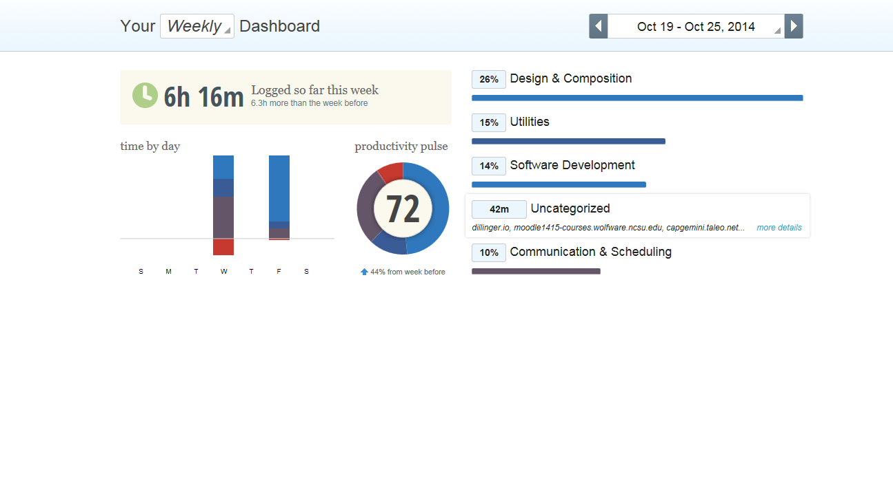
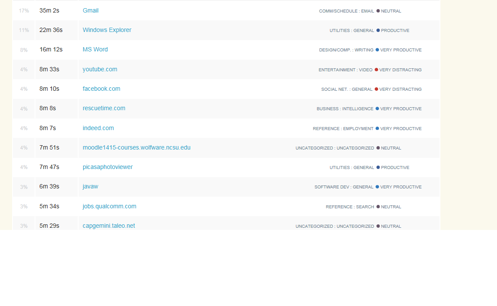
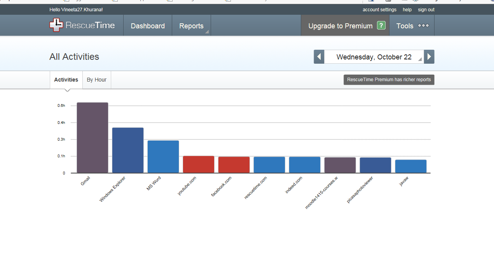
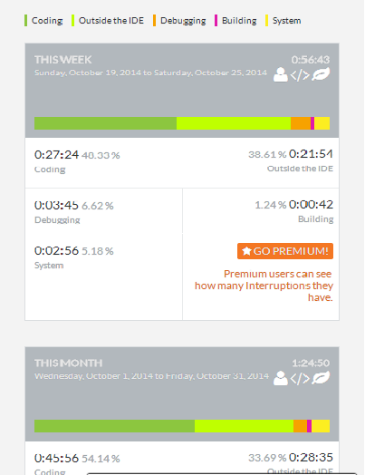
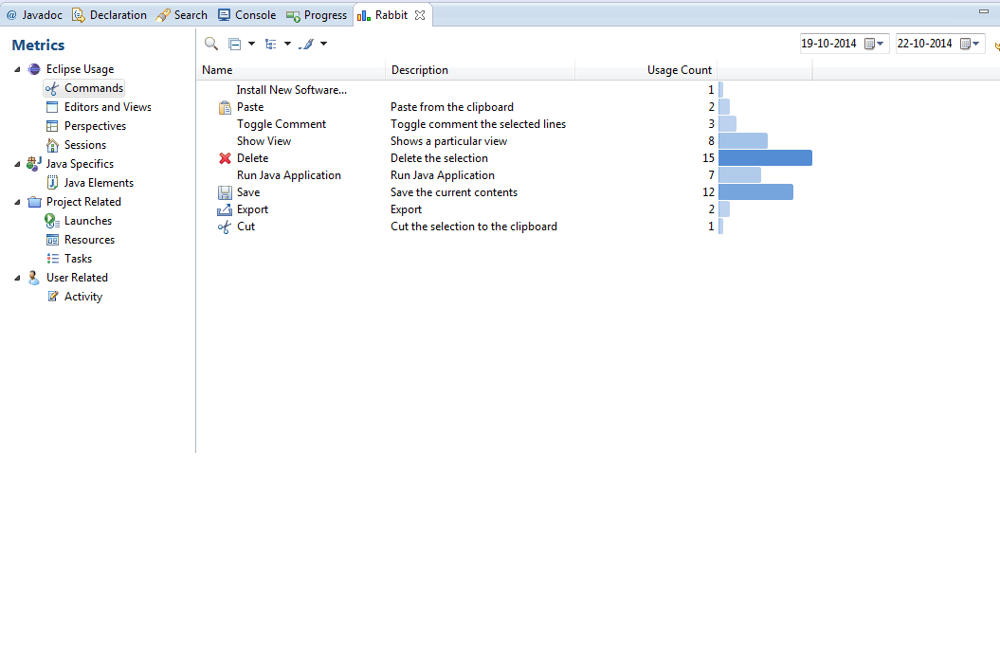
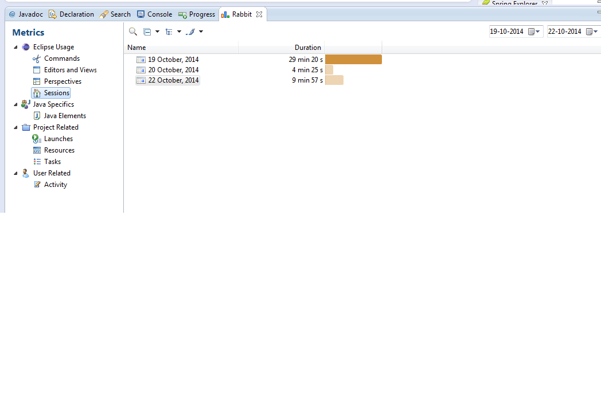

SUMMARY OF ACTIVITIES AND IMPROVEMENTS
=========
***VKHURAN2***

I used Recuetime, Codealike and Rabbit to track my activity on personal laptop for the week of 19th to 24th October. The Rescuetime tool shows the amount of activity and time spent on different websites and applications.  According to Rabbit and Codealike, I spent more time using the Java Editor and running the Java applications. Use of debugger was fairly less. As indicated by Rabbit, the commands mainly used were Cut, Paste, Delete, Save and Run Applications. The Java perspective was open for a longer period of time than Database and Debug perspective. I learnt that I should use the debugger more often to reduce time on running the application and then finding bugs.

Rescuetime indicates common websites visited are Google, Gmail, Facebook, Indeed, Kayak, Dillinger, Expedia, and Wolfware/Moodle. The time spent on Gmail and Facebook were considerably higher on 2 days than the rest. Other days there were a mix of websites visited like Wikipedia and job portals.  The days I didn’t use Facebook or spent lesser than 30mins, there was more productive work on software development and assignments.  I learnt that I could reduce time spent on social networking to improve time spent on coding. 

The applications most commonly used were Eclipse, Word, Paint, Picassa, and Calculator. Eclipse usage for coding was less on the days I was doing documentation assignments. Use of Indeed.com and other job portals is fairly good considering the time I have dedicated for job search. 

I learnt that I code for a longer period of time in continuation and should take breaks more often. The idle time between coding periods is more. So I should take frequent breaks during sections of a single coding sitting to avoid longer inter-coding break periods.

**The following are snapshots of activity as recorded by Codealike, Rabbit and RescueTime:**

**Weekly activity as per Rescue Time:**

**Day social networking was more prominent than other days:**

**Codealike report on activity using Eclipse:**

**Command history recorded by Rabbit:**

**Coding activity sessions as recorded by Rabbit:**

